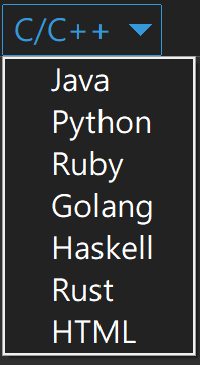

# This is a Code Signature 

### only input Name , Title , and body 

### New Version

### And choose the langrage 

### And Then generate the signature 

### example 

---

### Old version

### And choose the langrage 

### And Then generate the signature 

### example 

### So ***fast*** And ***easy***
